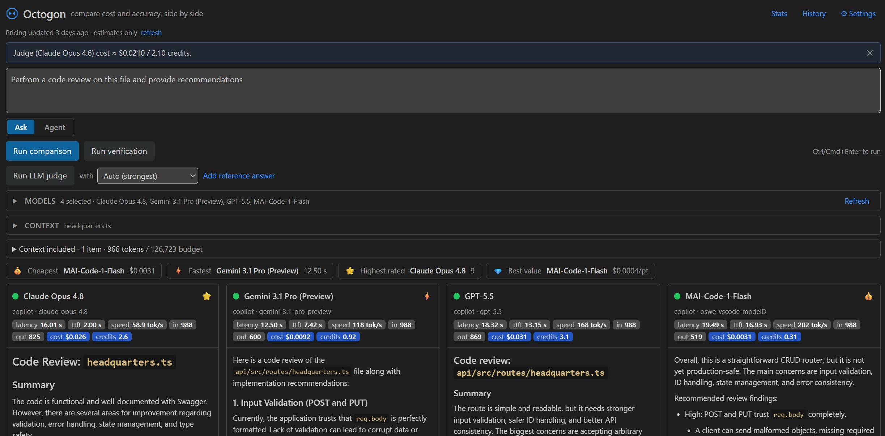
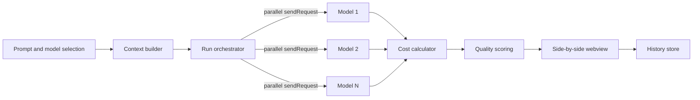

# Octogon

> **Stop guessing which Copilot model to use. Put them in the ring.**

[](https://github.com/thomasiverson/octogon/releases/latest)


Octogon pits the models in your **GitHub Copilot picker** against each other — same prompt, same repo, side by side — and scores them on the three things you actually care about: **cost**, **speed**, and **accuracy**.

Write one prompt, pick your models, and watch them answer in parallel — then compare responses, latency, token usage, real dollar/credit cost, and quality on one screen. No new API keys, no leaving your editor, no vibes-based decisions.

> [!TIP]
> **Just want to use it — no source code required?**
> [**Download the latest `.vsix` from Releases**](https://github.com/thomasiverson/octogon/releases/latest) and install it in VS Code via **Extensions → Install from VSIX…**. No cloning, no compiling, nothing else to set up. Full steps in [Install](#install-recommended).

<p align="center">
  
</p>

<p align="center"><em>One prompt → four models, scored live on cost, speed, and quality — with a cheapest · fastest · best leaderboard.</em></p>

---

## The problem

Copilot now ships a whole roster of models — and as of **June 2026 it's usage-based**, so every token you spend burns AI credits. That means two questions hit you on *every* task:

- **Which model is actually best for _this_ code?**
- **What is it going to cost me?**

Most people answer both by reputation and gut feel. That's a slow, expensive way to guess — and the "best" model on a benchmark leaderboard is rarely the best model for your repo, your prompt, and your budget.

## Enter the ring

Octogon replaces the guesswork with a head-to-head bout. One prompt goes out to every model you select; the answers stream back into side-by-side columns with a live scorecard underneath. Reputation stops mattering — **your** results do.

```text
                    one prompt · your repo
                               │
          ┌────────────────────┼────────────────────┐
          ▼                    ▼                    ▼
    ┌───────────┐        ┌───────────┐        ┌───────────┐
    │  Model A  │        │  Model B  │        │  Model C  │
    └───────────┘        └───────────┘        └───────────┘
          │                    │                    │
          └────────────────────┼────────────────────┘
                               ▼
                   cheapest · fastest · best
```

---

## Why you'll reach for it

- **See the tradeoff, not the hype.** Cost, latency, and quality for each model, on the same task, at the same time — the real picture a benchmark can't give you.
- **Know the price *before* you pay it.** A pre-run cost preview estimates USD and AI credits for the whole bout, so nothing surprises your bill. The post-run number is exact.
- **Judge quality your way.** Rate responses with stars, pick a winner, bring in an LLM-as-judge, or actually run the generated code against your build and tests.
- **Your models, your repo, your subscription.** Octogon reads the *exact* models in your Copilot picker and works against any open repository — with **no extra API keys** on the core path.
- **Keep the receipts.** Every bout can be saved to local history, reloaded, compared, and exported to JSON or Markdown. Build a body of evidence for how models perform on *your* work.

---

## What's in the box

| | Feature | Why it matters |
| --- | --- | --- |
| ⚔️ | **Side-by-side bouts** | One prompt → N models, streamed in parallel, one column each. |
| 💸 | **Real cost, not estimates-of-estimates** | Token cost in **USD and GitHub AI credits** (1 credit = $0.01) from a dated, overridable pricing table. |
| 🔮 | **Pre-run cost preview** | Approve the spend before a single token is sent. |
| 🏆 | **Live leaderboard** | Cheapest, fastest, and highest-rated — called the moment the round ends. |
| ⭐ | **Quality scoring** | Manual stars, pick-a-winner, and an opt-in **LLM-as-judge** with rubric + optional reference answer. |
| 📎 | **Repo-aware context** | Active file, selection, attached files, and lightweight retrieval — token-budgeted and shown transparently per run. |
| 🤖 | **Agent Mode (experimental)** | Turn each model loose as an autonomous, tool-using coding agent in its own sandbox. |
| 💾 | **Local history & export** | Save, reload, compare, and export every bout. Nothing leaves your machine. |

---

## The main event: Agent Mode 🤖

Regular bouts compare *answers*. Agent Mode compares *engineers*.

Flip on `octogon.agent.enabled` and each selected model runs as an **autonomous, tool-using coding agent** inside its own **isolated sandbox** copy of your repo. Each one reads files, writes changes, and runs your build or tests on its own — narrating its reasoning step by step — while you watch them work in parallel.

It's the ultimate bake-off: same task, same starting code, N models racing to a working solution. Optional iteration, time, and token caps keep every contender on a leash, and shell commands only run behind an explicit consent gate.

> Off by default. It's opt-in, sandboxed, and consent-gated — because letting models run commands deserves a deliberate "yes."

---

## Why a VS Code extension?

Because it's the only place the real fight can happen.

The models in your Copilot picker are reachable *only* through VS Code's **Language Model API** (`vscode.lm`). A standalone web app would be stuck with the smaller GitHub Models API — a different model set and no native repo access. Building as an extension gets you, for free:

- `vscode.lm.selectChatModels({ vendor: 'copilot' })` → the **exact** models in your picker.
- Native access to **any open repository** — just like everyday Copilot use.
- Accurate token counting and per-model context-window limits.
- Your existing Copilot subscription — **no extra API keys** for the core path.

---

## How it works



1. **Model registry** enumerates your Copilot models and handles the consent dialog.
2. **Context builder** assembles the prompt from the active file/selection, attached files, and retrieved snippets — trimmed to each model's context window.
3. **Run orchestrator** fires `sendRequest()` at every model in parallel, streams the columns, and records latency and token counts.
4. **Cost calculator** turns those tokens into USD and AI credits.
5. **Quality scoring** captures your ratings and, optionally, an LLM judge or automated tests.
6. **History store** saves the whole bout locally.

---

## Straight talk on cost

Octogon exists to help you *spend less*, so it's honest about spending:

- **As of June 1, 2026, Copilot bills usage-based.** Tokens convert to **GitHub AI credits at 1 credit = $0.01 USD**, priced per model (input / cached input / output per 1M tokens). Each plan includes an allowance; overage is billed at those rates.
- Octogon computes cost directly from that model: `inputTokens × inputRate + outputTokens × outputRate`, shown in **USD and credits**.
- **Comparing N models = N runs.** You pay for the tokens each model consumes; the LLM judge and Agent Mode add more. The pre-run preview and optional budget guard are there so it's always your call.

The rate table is **bundled, dated, and overridable** via `octogon.pricingTablePath` — see [pricing/model-pricing.json](pricing/model-pricing.json). You can also pull an updated table with **Octogon: Refresh Pricing** (opt-in, fetches from `octogon.pricingUrl`; no other network calls).

> Rates change often. The JSON carries a `lastUpdated` date and a `source` URL — re-verify against GitHub's official **Models and pricing** page.

---

## Who it's for

- **Individual developers** who want the best answer per credit on real tasks — not benchmark bragging rights.
- **Team leads and platform engineers** deciding which models to recommend (and budget for) across a codebase.
- **The curious** who want to *see*, with receipts, how GPT, Claude, Gemini, and other models actually differ on their code.

---

## Get in the ring

### Install (recommended)

No cloning, no build — just grab the packaged extension:

1. Download the latest `octogon-<version>.vsix` from the [**Releases** page](https://github.com/thomasiverson/octogon/releases).
2. Install it in VS Code, either way:
   - **Extensions** view → the **⋯** (Views and More Actions) menu → **Install from VSIX…**, then pick the file, or
   - from a terminal: `code --install-extension octogon-<version>.vsix`
3. Run **"Octogon: Open"** from the Command Palette. The first run triggers the Copilot consent dialog — grant model access and you're ready to fight.

The `.vsix` is **fully self-contained** — the extension host code and the React webview are bundled in, so there's nothing else to download or install.

> **Requirements:** VS Code 1.95+ and an active GitHub Copilot subscription (Octogon runs the models already in your Copilot picker).

### Build from source

Prefer to hack on it? Octogon lives at the repo root.

```bash
npm install
npm run build        # extension (esbuild) + webview (Vite)
# Press F5 in VS Code to launch the Extension Development Host
```

| Script | Purpose |
| --- | --- |
| `npm run build` | Build extension + webview |
| `npm run watch:extension` | Rebuild the extension on change |
| `npm run compile` | Type-check both projects (no emit) |
| `npm test` | Run the Vitest unit suite (LM mocked) |
| `npm run package` | Produce a `.vsix` |

### Try it on OctoCAT Supply

Point Octogon at a real repo in minutes. Full walkthrough in [docs/demo.md](docs/demo.md).

```bash
# OctoCAT Supply — the GitHub Copilot hands-on demo repo
git clone https://github.com/microsoft/GitHubCopilot_Customized
```

Open that folder, run the command, attach a couple of files (or lean on retrieval), and enter a task — for example, *"Add a discount field to the Product model and update related components"* — then pick 2–3 models and let them go.

---

## Configuration

| Setting | Description | Default |
| --- | --- | --- |
| `octogon.pricingTablePath` | Override path for the token pricing JSON | bundled |
| `octogon.pricingUrl` | Source URL for **Octogon: Refresh Pricing** (opt-in fetch) | repo raw JSON |
| `octogon.expectedOutputTokens` | Assumed output tokens for the pre-run estimate | `800` |
| `octogon.retrieval.topK` | Snippets pulled by lightweight retrieval | `5` |
| `octogon.judgeModelId` | Default LLM-as-judge model | unset |
| `octogon.verifyCommand` | Build/test command for automated verification | unset |
| `octogon.agent.enabled` | Turn on experimental Agent Mode | `false` |
| `octogon.agent.maxIterations` | Tool-call cap per agent (`0` = unlimited) | `0` |
| `octogon.agent.timeoutMs` | Wall-clock budget per agent (`0` = no limit) | `0` |
| `octogon.agent.maxTokens` | Token budget per agent (`0` = unlimited) | `0` |
| `octogon.agent.commandTimeoutMs` | Per-command timeout in the agent sandbox | `600000` |

---

## Under the hood

Built on the stack this repo already speaks — TypeScript everywhere, React for the UI.

| Layer | Choice |
| --- | --- |
| Extension host | TypeScript, VS Code Extension API (`vscode.lm`, workspace, commands, webview) |
| Webview UI | React 18 + Vite + Tailwind CSS + TypeScript |
| Bundling | esbuild (extension), Vite (webview) |
| Storage | JSON in extension global storage |
| Testing | Vitest — unit suites for the pure logic plus an activation smoke test; the language model and VS Code host are **mocked** in tests |

<details>
<summary>Project structure</summary>

```text
octogon/
├─ package.json                 # manifest: commands, configuration, deps
├─ esbuild.js                   # extension bundler
├─ src/
│  ├─ extension.ts              # activate(); registers octogon.open
│  ├─ models/registry.ts        # enumerate copilot-vendor models
│  ├─ context/                  # active file + selection + attached + retrieval
│  ├─ runner/orchestrator.ts    # parallel sendRequest + streaming + metrics
│  ├─ agent/                    # experimental agent loop, tools, sandbox
│  ├─ cost/                     # token cost math (USD + AI credits)
│  ├─ scoring/                  # manual, LLM-as-judge, verify
│  ├─ store/                    # local history + exporter + model stats
│  ├─ webview/panel.ts          # ComparePanel + typed message protocol
│  └─ shared/types.ts           # shared result/message types
├─ pricing/                     # published token-pricing table (refresh source)
├─ webview/                     # React + Vite app
├─ media/                       # built webview assets
└─ test/                        # Vitest unit suites (LM mocked)
```

</details>

---

## The name

**Octogon** — a play on GitHub's *octo-* branding (Octocat, Octoverse, Octokit) and the *octagon* competition ring where models go head-to-head. Stylized with an **o**; the dictionary spelling is "octagon."

---

## Disclaimers

- Cost figures use Copilot's usage-based rates (AI credits, 1 = $0.01) but are **estimates** — actual billing depends on exact token counts and your plan.
- Running comparisons — and especially the LLM judge, verification, and Agent Mode — consumes real tokens/credits against your Copilot allowance.
- Model availability depends on your Copilot plan and what's in your picker.

---

<div align="center">

**Models enter the ring. You leave with the data.**

</div>
