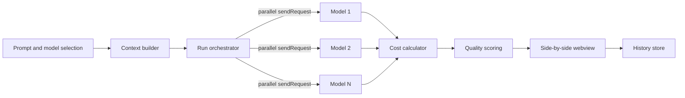

# Octogon

> Models enter the ring — compare them on **cost** and **accuracy**, side by side. A play on GitHub's *octo-* branding and the octagon competition ring.

A VS Code extension to compare the **cost** and **accuracy** of the models in your GitHub Copilot model picker — side by side, against any open repository (e.g., OctoCAT Supply).

Write one prompt, select multiple models from your **actual Copilot picker** (GPT, Claude, Gemini, o-series), run them in parallel, and compare responses, latency, token usage, **cost** (USD and GitHub AI credits), and **quality** (manual rating, LLM-as-judge, and optional automated test verification). Every run can be saved to local history.

---

## Table of contents

- [Why a VS Code extension?](#why-a-vs-code-extension)
- [Features](#features)
- [How it works](#how-it-works)
- [Tech stack](#tech-stack)
- [Cost model (read this)](#cost-model-read-this)
- [Repo context strategy](#repo-context-strategy-v1)
- [Quality / accuracy scoring](#quality--accuracy-scoring)
- [Project structure](#project-structure)
- [Implementation roadmap](#implementation-roadmap)
- [Configuration](#configuration)
- [Getting started (development)](#getting-started-development)
- [Testing & verification](#testing--verification)
- [Decisions & assumptions](#decisions--assumptions)
- [Open considerations](#open-considerations)
- [Naming](#naming)
- [Disclaimers](#disclaimers)

---

## Why a VS Code extension?

The models in your Copilot picker are only reachable through VS Code's **Language Model API** (`vscode.lm`). A standalone web app would have to use the GitHub Models API instead — a different, smaller model set, and no native repo access.

By building an extension we get, for free:

- `vscode.lm.selectChatModels({ vendor: 'copilot' })` → the **exact** models in your picker.
- Native access to **any open repository** — works just like daily Copilot use.
- Token counting (`model.countTokens`) and context-window limits (`model.maxInputTokens`).
- Your existing Copilot subscription — **no extra API keys** for the core path.

---

## Features

- **Side-by-side comparison panel** (webview) with one prompt → N models.
- **Parallel streaming** responses, one column per model.
- **Token-based cost** per model — Copilot's usage-based rates × measured input/output tokens, shown in **USD and GitHub AI credits** (1 credit = $0.01).
- **Pre-run cost preview** — estimated USD / credits for the run before you spend anything.
- **Quality scoring**: manual rating (stars / pick-a-winner), LLM-as-judge (rubric + optional reference answer), and — as a stretch — automated build/test verification for code tasks.
- **Repo-aware context**: active file + selection, manually attached files, and lightweight keyword/semantic retrieval across the open repo (token-budgeted).
- **Leaderboard**: cheapest / fastest / highest-rated per run.
- **Local run history** with reload, compare, and export (JSON / Markdown).

---

## How it works



1. **Model registry** enumerates Copilot models via `selectChatModels` (handles the consent dialog and the empty-list case).
2. **Context builder** assembles the prompt from the active file/selection, attached files, and retrieved snippets — folded into the first User message (`vscode.lm` does not support system messages), trimmed to each model's `maxInputTokens`.
3. **Run orchestrator** calls `model.sendRequest()` for every selected model in parallel, streams results into columns, and records latency + input/output token counts.
4. **Cost calculator** computes token cost (USD + AI credits) from the local pricing table.
5. **Quality scoring** captures manual ratings and (optionally) runs an LLM judge and/or automated tests.
6. **History store** persists the full run to extension global storage.

---

## Tech stack

| Layer | Choice |
| --- | --- |
| Extension host | TypeScript, VS Code Extension API (`vscode.lm`, workspace, commands, webview) |
| Webview UI | React 18 + Vite + Tailwind CSS + TypeScript |
| Extension bundling | esbuild |
| Storage | JSON (extension global storage) — SQLite optional later |
| Testing | Vitest/Jest (unit), `@vscode/test-electron` (integration); the LM is **mocked** in tests |

This matches both the OctoCAT Supply demo stack and the TypeScript/React conventions in this workspace.

---

## Cost model (read this)

**As of June 1, 2026, GitHub Copilot bills usage-based.** Token usage is converted to **GitHub AI credits** at **1 credit = $0.01 USD**, priced per model — input / cached input / output per 1M tokens (Anthropic adds a cache-write rate). Each plan includes an AI-credit allowance; overage is billed at those per-token rates.

Octogon computes cost directly from that model:

- **Token cost** = `inputTokens × inputRate + outputTokens × outputRate`, shown in **USD and AI credits**.
- Because output tokens are only known after a run, the **pre-run preview** estimates from input tokens + a configurable expected-output estimate; the **post-run** number is exact.
- **Comparing N models = N runs** — you pay for the tokens each model consumes. Enabling the LLM judge adds more.

The rate table is **bundled and pre-populated** (verified 2026-06-25) and user-overridable via `octogon.pricingTablePath`:

- [src/cost/data/model-pricing.json](src/cost/data/model-pricing.json) — usage-based token rates.

> **Note:** Rates change often. Re-verify against GitHub's official **Models and pricing** page; the JSON carries a `lastUpdated` date and `source` URL.

---

## Repo context strategy (v1)

Context is built from, in order, until the token budget is reached:

1. **Active editor file** + current selection.
2. **Manually attached files** (QuickPick / webview file tree).
3. **Lightweight retrieval** — keyword/identifier search across the open repo, top-K snippets (closer to `#codebase`).

The exact context injected is shown with each run for transparency. Full embeddings RAG is a possible future upgrade.

---

## Quality / accuracy scoring

- **Manual** — rate each response (stars) or pick the winner; saved with the run.
- **LLM-as-judge** — choose a judge model; it scores each response against a rubric (and optional reference answer) and returns a score + rationale. Opt-in (consumes extra tokens/credits).
- **Automated task verification** *(stretch)* — for code tasks, apply each model's output to a scratch copy of the repo and run its build/tests (e.g., OctoCAT Supply `make build` / `make test`), recording pass/fail.

---

## Project structure

```text
ai-cost-comparison/
├─ package.json                 # manifest: command, configuration, deps
├─ tsconfig.json
├─ esbuild.js                   # extension bundler
├─ src/
│  ├─ extension.ts              # activate(); registers octogon.open
│  ├─ models/registry.ts        # enumerate copilot-vendor models
│  ├─ context/
│  │  ├─ contextBuilder.ts      # active file + selection + attached
│  │  └─ retrieval.ts           # lightweight keyword/semantic top-K
│  ├─ runner/orchestrator.ts    # parallel sendRequest + streaming + metrics
│  ├─ cost/
│  │  ├─ costCalculator.ts      # token cost math (USD + AI credits)
│  │  └─ data/
│  │     └─ model-pricing.json
│  ├─ scoring/
│  │  ├─ manual.ts
│  │  ├─ judge.ts               # LLM-as-judge
│  │  └─ verify.ts              # automated tests (stretch)
│  ├─ store/historyStore.ts     # JSON in globalStorage
│  ├─ webview/panel.ts          # ComparePanel + typed message protocol
│  └─ shared/types.ts           # shared result/message types
├─ webview/                     # React + Vite app
│  ├─ index.html
│  ├─ vite.config.ts
│  └─ src/{main.tsx,App.tsx,components/…}
├─ media/                       # built webview assets
├─ test/
└─ README.md
```

---

## Implementation roadmap

| Phase | Deliverable | Independently verifiable? |
| --- | --- | --- |
| **0. Scaffold** | Extension + Vite/React/Tailwind webview, `octogon.open` command, typed message protocol | Panel opens |
| **1. Core loop** | Model enumeration + consent handling + parallel run + side-by-side streaming + latency/tokens | Prompt → 2-3 models → streamed columns |
| **2. Cost engine** | Token cost (USD + AI credits), pre-run cost preview, leaderboard | Costs + leaderboard render |
| **3. Repo context** | Active file + attached files + lightweight retrieval, token-budgeted, with transparency | Context shown per run |
| **4. Quality** | Manual rating + LLM-as-judge (opt-in) | Ratings + judge scores saved |
| **5. Persistence** | Local history save / reload / compare / export | Reload a past run |
| **6. Verification (stretch)** | Run code output against repo build/tests | Pass/fail recorded |
| **7. Polish** | README, settings docs, OctoCAT Supply demo script, disclaimers | — |

---

## Configuration

| Setting | Description | Default |
| --- | --- | --- |
| `octogon.pricingTablePath` | Override path for the token pricing JSON | bundled |
| `octogon.expectedOutputTokens` | Assumed output tokens for the pre-run cost estimate | `800` |
| `octogon.retrieval.topK` | Snippets pulled by lightweight retrieval | `5` |
| `octogon.judgeModelId` | Default LLM-as-judge model | unset |
| `octogon.verifyCommand` | Build/test command for automated verification | unset |

---

## Getting started (development)

The extension lives at the **repo root**.

```bash
npm install
npm run build        # builds the extension (esbuild) + webview (Vite)
# Press F5 in VS Code to launch the Extension Development Host
```

Useful scripts:

| Script | Purpose |
| --- | --- |
| `npm run build` | Build extension + webview into `dist/` and `media/` |
| `npm run watch:extension` | Rebuild the extension on change |
| `npm run compile` | Type-check both projects (no emit) |
| `npm test` | Run the Vitest unit suite (LM mocked) |
| `npm run package` | Produce a `.vsix` |

Then run **"Octogon: Open"** from the Command Palette. The first run triggers the Copilot consent dialog.

### Try it on OctoCAT Supply

See [docs/demo.md](docs/demo.md) for a full walkthrough.

```bash
git clone https://github.com/Azure-Samples/octocat-supply
```

Open that folder, run the command, attach a couple of files (or rely on retrieval), enter a task (e.g., *"Add a discount field to the Product model and update related components"*), pick 2-3 models, and compare.

---

## Testing & verification

- **Unit tests** (mocked LM): cost math, token budgeting, retrieval ranking, message protocol.
- **Integration** (`@vscode/test-electron`): command registration, panel lifecycle — **no real LM calls** (rate-limited per VS Code guidance).
- **Manual**: consent flow, empty-model handling, `LanguageModelError`/rate-limit handling, run on a second repo, export.

---

## Decisions & assumptions

- VS Code extension + React/Vite/Tailwind webview; Copilot-vendor models only for the core path (no external keys).
- Cost is token-based (USD + AI credits); the pricing table is bundled, user-overridable, and dated.
- No system messages in `vscode.lm` → instructions fold into the first User message.
- Local only in v1; no cloud deployment.
- Assumes an active GitHub Copilot subscription with model-picker access.

---

## Open considerations

1. **History storage** — JSON-lines + index (zero native deps) vs SQLite (richer queries). *JSON recommended for v1.*
2. **Token/credit burn** — N models × tokens + judge adds up fast. *Mandatory cost preview + optional per-session budget guard.*
3. **Pricing freshness** — bundle a dated snapshot + "last updated" banner + easy override rather than live fetching.

---

## Naming

Name: **Octogon** — a play on GitHub's *octo-* branding (Octocat, Octoverse, Octokit) and the *octagon* competition ring where models go head-to-head. (Stylized with an **o**; the dictionary spelling is "octagon.")

> Avoid putting **"Copilot"** in the published extension name/ID — VS Code Marketplace and GitHub trademark guidance discourage names that imply official affiliation. It's fine to say *"compares your GitHub Copilot models"* in the description; keep it out of the title.

---

## Disclaimers

- Token cost figures use Copilot's usage-based rates (AI credits, 1 = $0.01) but are **estimates** — actual billing depends on exact token counts and your plan.
- Running comparisons consumes real tokens/credits against your Copilot AI-credit allowance.
- Model availability depends on your Copilot plan and what's in your picker.
