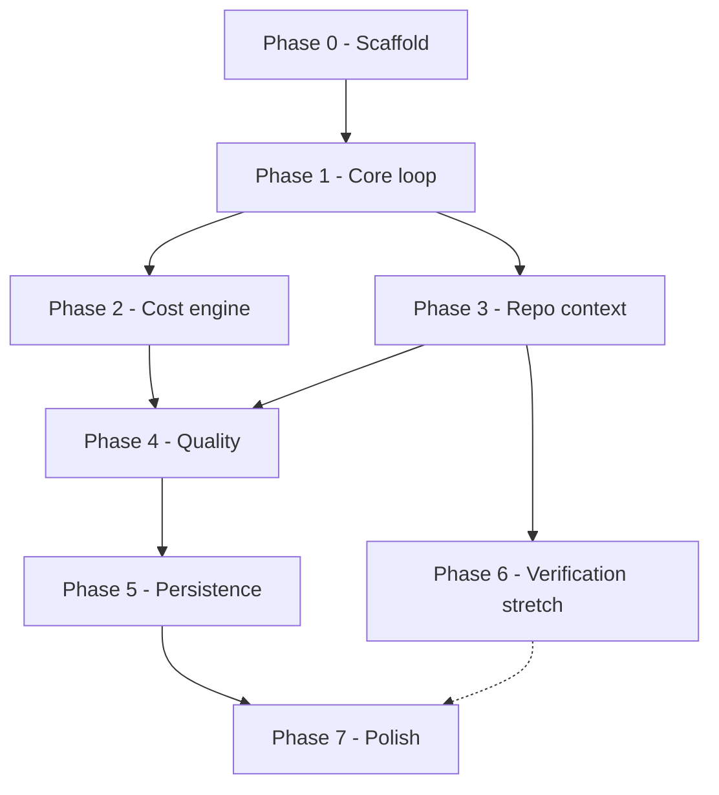

# Octogon — Implementation Plan

Phased build plan for **Octogon**, a VS Code extension that compares the **cost** and **accuracy** of the models in your GitHub Copilot model picker — side by side, against any open repo. See [../README.md](../README.md) for the full product overview.

---

## How to use this plan with agent sessions

- Each `phase-N-*.md` file is **self-contained**: run **one phase per agent session**.
- Start a fresh session, point the agent at the phase file, let it complete every task, then check the **Acceptance criteria** before moving to the next phase.
- Phases are ordered by dependency — don't skip. **Phase 6 is optional** (stretch).
- The extension source lives at the **repo root** (alongside `README.md`); this `plan/` folder is documentation only.

> Suggested kickoff prompt per session:
> *"Implement Phase N of Octogon as described in `plan/phase-N-*.md`. Complete all tasks, keep the conventions below, and verify every acceptance criterion before finishing."*

---

## Prerequisites

- Node.js 18+ and npm
- VS Code 1.90+ (Language Model API is GA)
- Active GitHub Copilot subscription with model-picker access
- For testing: `git clone https://github.com/Azure-Samples/octocat-supply`

## Tech stack

- **Extension host:** TypeScript, VS Code Extension API (`vscode.lm`, workspace, commands, webview)
- **Webview UI:** React 18 + Vite + Tailwind CSS + TypeScript
- **Bundling:** esbuild (extension), Vite (webview)
- **Storage:** JSON in extension `globalStorage`
- **Tests:** Vitest (unit) + `@vscode/test-electron` (integration)

## Global conventions (apply to every phase)

- **Namespace:** use `octogon.*` for all commands and configuration keys.
- **TypeScript strict mode**; avoid `any` without justification.
- **Never call the Language Model API in tests** (rate limits) — mock it. Keep prompt-building and parsing pure/testable.
- **`vscode.lm` has no system messages** → fold instructions into the first `User` message.
- Always handle: **empty model list**, **`LanguageModelError`** (incl. `off_topic` / quota), and **cancellation**.
- Treat all pricing numbers as **estimates**; surface a "last updated" note and allow overrides.
- The extension must work on **any open repo** — never hardcode OctoCAT Supply.

---

## Phase map

| Phase | File | Outcome | Optional |
| --- | --- | --- | --- |
| 0 | [phase-0-scaffold.md](phase-0-scaffold.md) | Runnable extension + empty React webview opened by `octogon.open` | No |
| 1 | [phase-1-core-loop.md](phase-1-core-loop.md) | Prompt → multi-model parallel run → side-by-side streaming + metrics | No |
| 2 | [phase-2-cost-engine.md](phase-2-cost-engine.md) | Dual cost view, pre-run cost preview, leaderboard | No |
| 3 | [phase-3-repo-context.md](phase-3-repo-context.md) | Active file + attached files + lightweight retrieval, token-budgeted | No |
| 4 | [phase-4-quality.md](phase-4-quality.md) | Manual rating + LLM-as-judge | No |
| 5 | [phase-5-persistence.md](phase-5-persistence.md) | Save / browse / reload / export run history | No |
| 6 | [phase-6-verification.md](phase-6-verification.md) | Automated build/test verification for code tasks | Stretch |
| 7 | [phase-7-polish.md](phase-7-polish.md) | Docs, tests, demo script, packaging | No |

## Dependency graph

